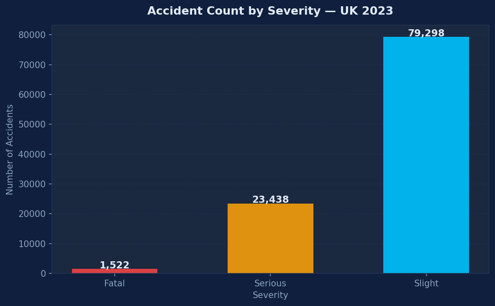
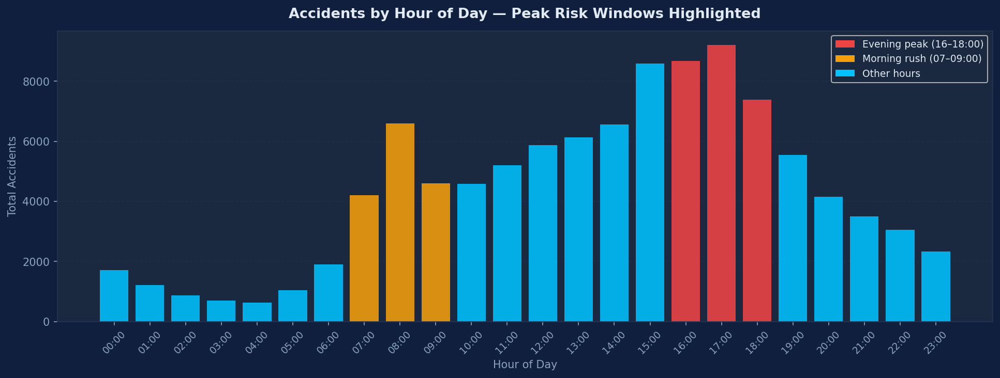
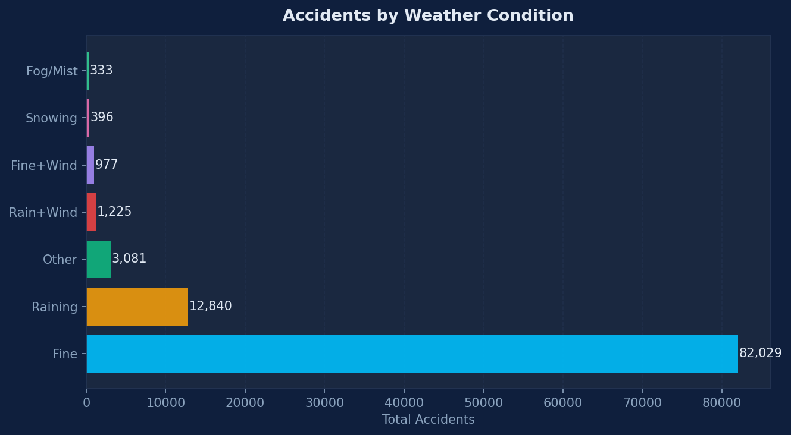
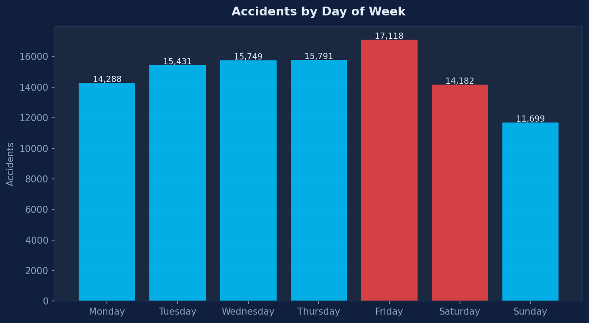
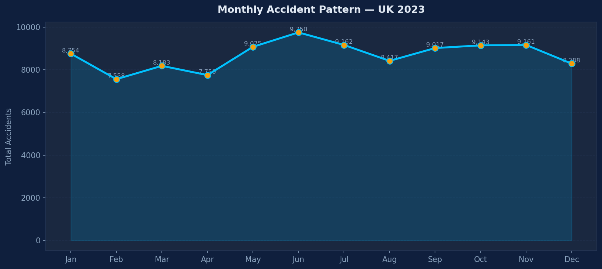
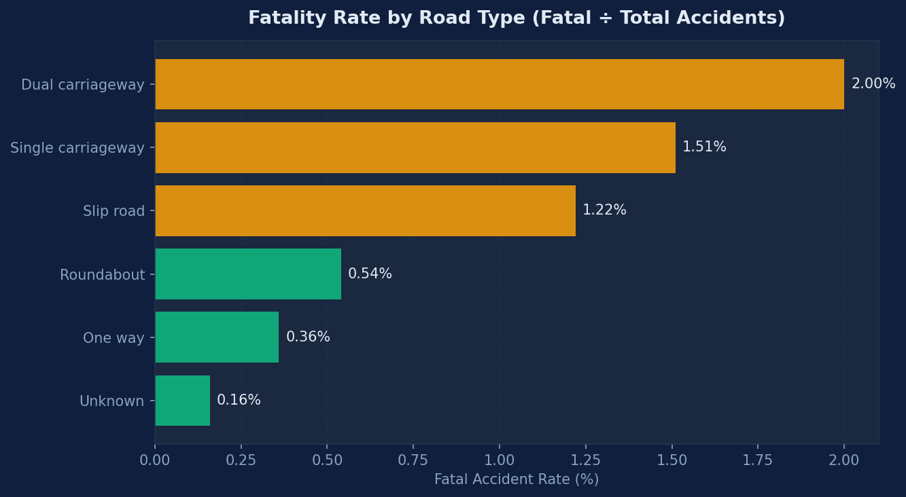

# uk-road-safety-analysis
# 🚦 UK Road Safety Analysis — 2023
> Python · Pandas · Matplotlib · Jupyter


## Business Question
> *Where, when, and under what conditions are UK roads most dangerous —
> and what should policymakers do about it?*

---

## Key Findings

| Finding | Insight | Recommendation |
|---|---|---|
| ⏰ **Peak Risk Hour** | 17:00 is the single highest-risk hour on UK roads | Variable speed limits during evening commute |
| 🌤 **Fine Weather Paradox** | 60%+ of accidents happen in clear weather | Driver complacency awareness campaigns |
| 🛣 **Road Type Risk** | Single carriageways have the highest fatal rate | Central reservations on rural A-roads |
| 📅 **Weekend Clustering** | Friday & Saturday dominate weekend accidents | Concentrate enforcement on Fri/Sat evenings |

---

## Charts








---

## Dataset

- **Source:** UK Department for Transport — STATS19 Open Data
- **Link:** https://www.gov.uk/government/statistics/road-safety-data
- **File:** dft-road-casualty-statistics-collision-2023.csv
- **Size:** 104,258 accidents · 38 variables
- **Licence:** Open Government Licence v3.0 (free to use)

---

## How to Run

```bash
# 1. Clone this repo
git clone https://github.com/shreyasingh20001126/uk-road-safety-analysis

# 2. Install dependencies
pip install pandas numpy matplotlib seaborn jupyter

# 3. Download the dataset from the link above
#    Save it in the same folder as the notebook

# 4. Open the notebook
jupyter notebook project1_FIXED_notebook.ipynb
```

---

## Project Structure
uk-road-safety-analysis/

├── project1_FIXED_notebook.ipynb   ← Full analysis with business insights

├── accidents_2023_clean.csv        ← Cleaned dataset

├── README.md

├── chart_severity.png

├── chart_hourly.png

├── chart_daily.png

├── chart_monthly.png

├── chart_weather.png

└── chart_road_type.png
---

## Skills Demonstrated

- Real-world data cleaning (coded values, datetime parsing, missing data handling)
- Exploratory Data Analysis (EDA) on 100,000+ row government dataset
- Data visualisation with professional dark theme
- Business insight generation from raw data
- Structured analytical storytelling for non-technical stakeholders

---

## Business Insights

**1. The Fine Weather Paradox**
Most accidents occur in clear conditions — drivers are more cautious in bad weather,
creating a complacency risk in good conditions. Awareness campaigns should target
summer months and dry-weather driving specifically.

**2. Evening Commute is the Deadliest Window**
16:00–18:00 consistently shows the highest accident volumes. Combined with end-of-day
fatigue, this window represents the single biggest intervention opportunity for traffic policy.

**3. Single Carriageways Punch Above Their Weight**
Despite lower total volumes, single carriageways have a disproportionately high fatality
rate due to head-on collision risk. Central reservation installation on high-risk routes
would have the greatest impact per pound spent.

---

*Data: UK Department for Transport STATS19 · Open Government Licence v3.0*
*Author: Shreya Singh | MSc Data Science*
